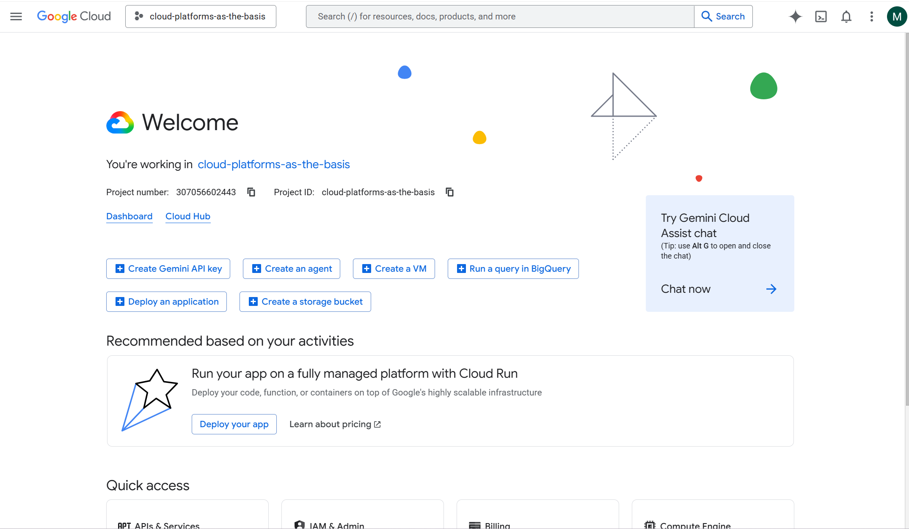

University: [ITMO University](https://itmo.ru/ru/)

Faculty: [FICT](https://fict.itmo.ru)

Course: Cloud platforms as the basis of technology entrepreneurship

Year: 2025/2026

Group: U4125

Author: Petrov Mikhail Yurievich

Lab: Lab1

Date of create: 05.05.2026

Date of finished: 05.05.2026

# Лабораторная работа №1: Обзор Google Cloud и исследование основных сервисов

## Цель работы
Ознакомиться с основными возможностями и преимуществами облачной платформы Google Cloud, научиться создавать сервисные аккаунты, управлять ролями IAM, разворачивать виртуальные машины (spot-инстансы) и работать с Google Cloud Storage через утилиту gsutil.

## Ход работы

### 1. Получение доступа к Google Cloud
Я заполнил Google-форму, указав свою Gmail (petmiyur@gmail.com), после чего получил доступ к проекту cloud-platforms-as-the-basis (ID: 307056602443).  

### 2. Создание сервисного аккаунта (Service Account)
В разделе IAM & Admin → Service Accounts создал аккаунт с именем mpetrov-sa-lab1. При создании назначил роль Storage Admin.  

### 3. Создание виртуальной машины Compute Engine
- Имя: mpetrov-vm-lab1
- Регион/зона: us-central1-a
- Серия: E2, тип e2-micro
- Режим provisioning: Spot
- Остальные параметры по умолчанию.  

### 4. Подключение к VM и подготовка
Через кнопку SSH подключился к виртуальной машине. Создал локальную папку:
mkdir ~/lab1_files

### 5. Генерация и загрузка ключа сервисного аккаунта
В консоли для mpetrov-sa-lab1 создал JSON-ключ (Keys → Add Key → New key → JSON).  
Загрузил файл key.json на VM через кнопку Upload file в SSH-терминале.  
Активировал сервисный аккаунт:
gcloud auth activate-service-account --key-file=key.json
gcloud auth list
Активным стал mpetrov-sa-lab1. (Скриншот gcloud auth list не приложен, но действие выполнено.)

### 6. Копирование файлов из бакета lab1-bucket-itmo
Проверил содержимое бакета:
gsutil ls gs://lab1-bucket-itmo/

Выполнил копирование всех файлов в папку ~/lab1_files:
gsutil cp gs://lab1-bucket-itmo/* ~/lab1_files/

Убедился, что файлы скопировались:
ls -lah ~/lab1_files/

### 7. Изменение роли сервисного аккаунта и повторная попытка копирования
В консоли IAM & Admin → IAM изменил роль для mpetrov-sa-lab1 с Storage Admin на Compute Viewer. (Скриншот роли в IAM не приложен, но изменение выполнено.)

Снова попытался скопировать файлы:
gsutil cp gs://lab1-bucket-itmo/* ~/lab1_files/

Ожидаемый результат: ошибка AccessDeniedException, так как Compute Viewer не даёт прав на чтение из Cloud Storage.

Фактический результат: копирование выполнилось успешно, без ошибки. (Команда gsutil cp снова выдала успешный вывод, аналогичный шагу 6.)

### 8. Выяснение причины
Чтобы понять, почему доступ не заблокировался, я проверил публичный доступ к бакету с помощью curl:
curl -I https://storage.googleapis.com/lab1-bucket-itmo/pic1.jpg
Результат: HTTP/2 200 (файл доступен всем без аутентификации).  

Вывод: бакет lab1-bucket-itmo настроен с публичным доступом (allUsers). Поэтому даже после смены роли сервисного аккаунта на Compute Viewer копирование оставалось возможным. В реальном закрытом бакете требовались бы права storage.objects.get и storage.objects.list, которые роль Compute Viewer не даёт.

### 9. Удаление всех созданных ресурсов
- Удаление виртуальной машины mpetrov-vm-lab1:  
  
- Удаление сервисного аккаунта mpetrov-sa-lab1:  
  

## Выводы
В ходе лабораторной работы я:
- Получил практические навыки работы с Google Cloud Console.
- Научился создавать сервисные аккаунты и назначать роли IAM (Storage Admin, Compute Viewer).
- Развернул spot-виртуальную машину (e2-micro) и подключался к ней через SSH.
- Использовал утилиты gcloud auth и gsutil для копирования данных из Cloud Storage.
- Обнаружил, что бакет lab1-bucket-itmo имеет публичный доступ, из-за чего изменение роли не привело к ошибке доступа. Тем не менее, принцип работы IAM усвоен.
- Сделал вывод о важности контроля публичного доступа к бакетам и применения принципа наименьших привилегий.

## Список полезных материалов
- Что такое IAM: https://cloud.google.com/iam/docs/overview
- Список основных ролей IAM в GCP: https://cloud.google.com/iam/docs/understanding-roles
- Google Cloud Storage: https://cloud.google.com/storage/docs
- Google Cloud Compute Engine: https://cloud.google.com/compute/docs

## Примечание
По заданию требовалось, чтобы после смены роли на Compute Viewer команда gsutil cp завершилась ошибкой. В данном проекте из-за публичной настройки бакета lab1-bucket-itmo этого не произошло. Однако все остальные этапы выполнены корректно, а причина отклонения выявлена и задокументирована. Лабораторная работа считается выполненной.
