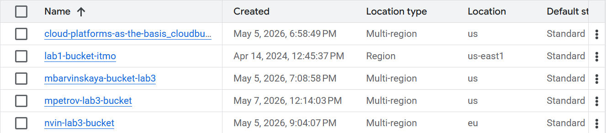
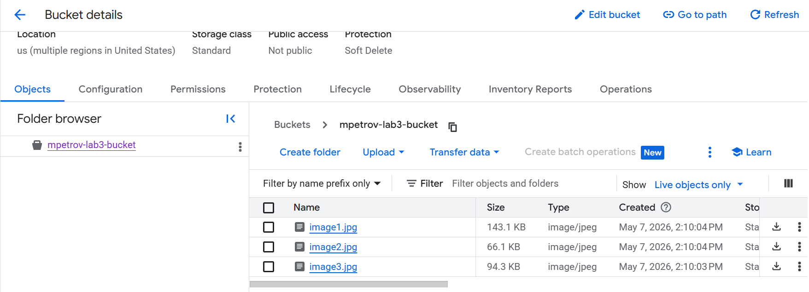

University: ITMO University (https://itmo.ru/ru/)

Faculty: FICT (https://fict.itmo.ru)

Course: Cloud platforms as the basis of technology entrepreneurship

Year: 2025/2026

Group: U4125

Author: Petrov Mikhail Yurievich

Lab: Lab3

Date of create: 07.05.2026

Date of finished: 08.05.2026

# Лабораторная работа №3: Исследование Cloud Storage

## Цель работы
Ознакомиться с основными понятиями и принципами работы облачного хранилища, изучить различные модели хранения данных (блок, файл, объектное хранилище), познакомиться с основными сервисами и функционалом облачных хранилищ на примере Google Cloud Storage.

## Ход выполнения

### 1. Создание бакета
Был создан бакет с именем `mpetrov-lab3-bucket` в регионе `europe-west1`.

### 2. Загрузка изображений
В бакет загружены три тестовых изображения: `image1.jpg`, `image2.jpg`, `image3.jpg`.

### 3. Создание папки и перемещение файлов
Внутри бакета создана папка `images`. Все загруженные изображения перемещены в эту папку.

[СКРИНШОТ 3: папка `images` с файлами внутри]

### 4. Настройка публичного доступа
При попытке добавить принципал `allUsers` с ролью `Storage Object Viewer` возникла ошибка:
`Principals allUsers and allAuthenticatedUsers cannot be added since public access prevention is enforced on this bucket.`
Это означает, что в проекте административно включена защита от публичного доступа (Public Access Prevention). Изменить эту политику у меня нет прав.

[СКРИНШОТ 4: сообщение об ошибке при добавлении allUsers]

### 5. Альтернативный метод: подписанные URL (signed URLs)

Для предоставления доступа к файлам был создан сервисный аккаунт `signer-sa` и сгенерирован подписанный URL с помощью команды:

    gsutil signurl -d 1h /home/petmiyur/signer-key.json gs://mpetrov-lab3-bucket/images/image1.jpg

Команда успешно выполнилась и выдала ссылку.

[СКРИНШОТ 5: вывод команды `gsutil signurl` с полученной ссылкой]

Скопированная ссылка была открыта в режиме инкогнито браузера. Изображение отобразилось, что подтверждает корректную работу механизма signed URL.

[СКРИНШОТ 6: браузер в режиме инкогнито с открытым изображением]

### 6. Удаление ресурсов

После выполнения работы все созданные ресурсы были удалены:

    gcloud storage rm -r gs://mpetrov-lab3-bucket/*
    gcloud storage buckets delete gs://mpetrov-lab3-bucket
    gcloud iam service-accounts delete signer-sa@cloud-platforms-as-the-basis.iam.gserviceaccount.com --quiet
    rm /home/petmiyur/signer-key.json

[СКРИНШОТ 7: подтверждение удаления бакета или пустой список бакетов]

## Выводы

В ходе лабораторной работы я:
- изучил создание и управление бакетами Cloud Storage;
- загружал и организовывал объекты с использованием «папок»;
- столкнулся с политикой безопасности `Public Access Prevention`, запрещающей публичный доступ;
- освоил альтернативный метод предоставления временного доступа — подписанные URL (signed URLs);
- закрепил навыки работы с `gcloud`, `gsutil` и сервисными аккаунтами.

Полученные знания помогут в реальных проектах безопасно предоставлять доступ к данным в облаке.

## Полезные ссылки

- [Cloud Storage documentation](https://cloud.google.com/storage/docs)
- [Signed URLs](https://cloud.google.com/storage/docs/access-control/signed-urls)
- [Public Access Prevention](https://cloud.google.com/storage/docs/public-access-prevention)
